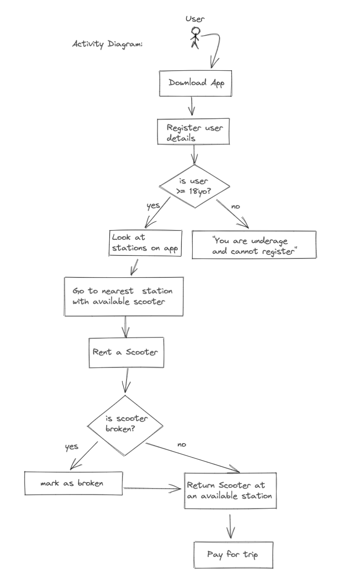
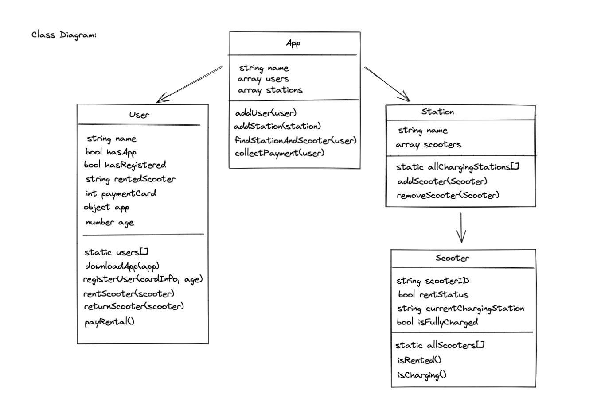
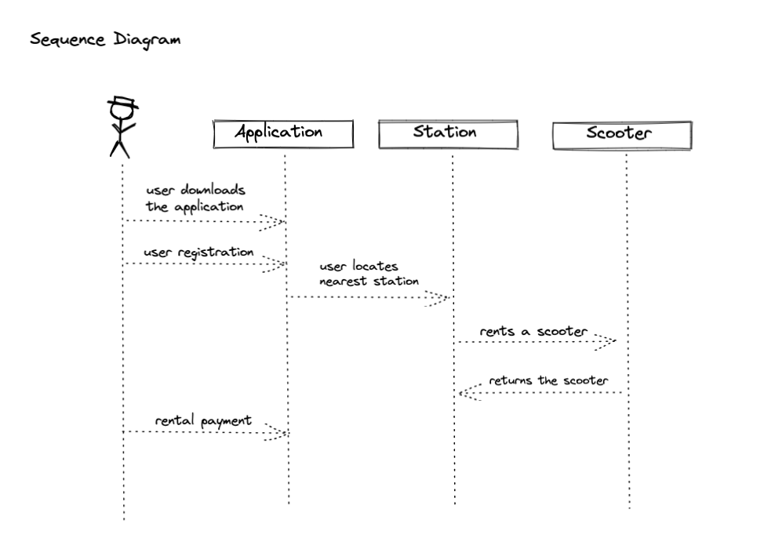
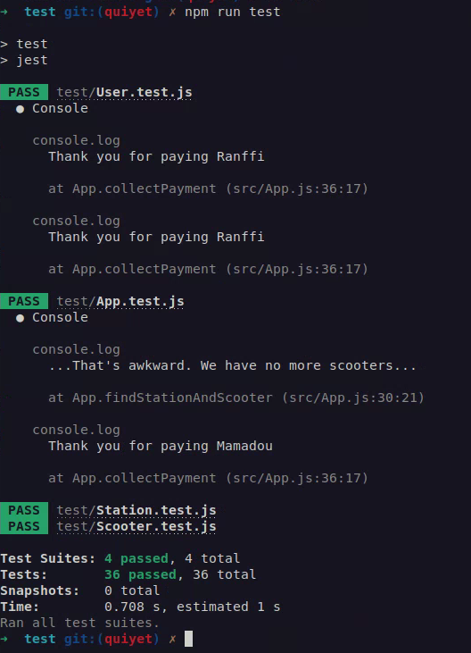

# Electric Scooter Hire App

## Description

The task is to develop an application, where a user can find an available scooter at charging station. Here are the MVP requirements:

- To rent a scooter, a user must download the app
- Electric Scooter Hire app and register their details
- Scooters are rented from charging stations
- There are multiple charging stations in the city
- A scooter must be returned to a charging station
- Payment is taken once the user has returned their scooter

## Table of Contents

- [Activity Diagram](#Activity-Diagram)
- [Class Diagram](#Class-Diagram)
- [Sequence Diagram](#Sequence-Diagram)
- [Built With](#Built-With)
- [Installation](#Installation)
- [Features](#Features)
- [Contributors](#Contributors)

## Activity Diagram



## Class Diagram



## Sequence Diagram



## Built with:

- [VS Code](https://code.visualstudio.com/)
- [npm](https://www.npmjs.com/)
- [NodeJS](https://nodejs.org/en/)
- [Jest](https://jestjs.io/)

## Installation

1. Clone the repository

```bash
git clone https://github.com/quiyetbrul/scooter-rental.git
```

2. Change the working directory

```bash
cd ${PATH}/scooter-rental
```

3. Install dependencies
   1. Jest for testing

```bash
npm install jest
```
   2. Chalk for console output color

```bash
npm install chalk
```

4. Run the program

```bash	
node src/index.js
```

5. Run the test cases

```bash
cd ${PATH}/scooter-rental/test; npm run test
```

6. See previous test case log

```bash
cat test_cases.txt
```



## Features

- Find a charging station with available scooter(s) to rent/ slot to return scooters
- Multiple charging stations
- Rent a scooter
- Return a scooter
- Secure payment

## Contributors

- [Quiyet Brul](https://github.com/quiyetbrul/scooter-rental)
- [Jazmin Matos](https://github.com/jazminmatos)
- [Ranffi Ramirez](https://github.com/ranffi)
- [Mamadou Diallo](https://github.com/saliouprogress)