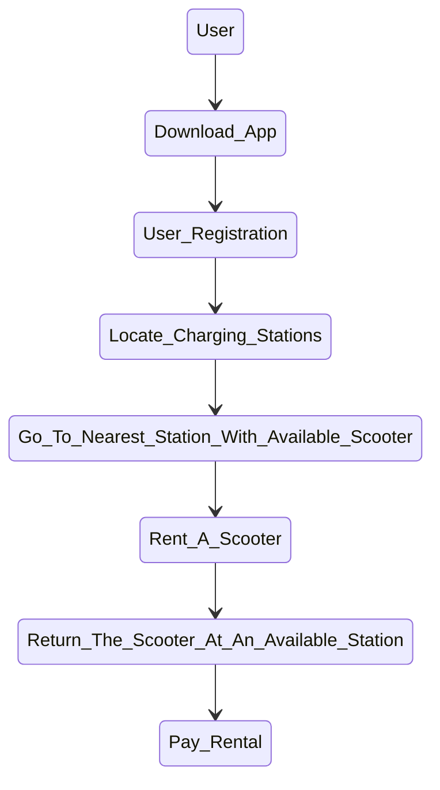
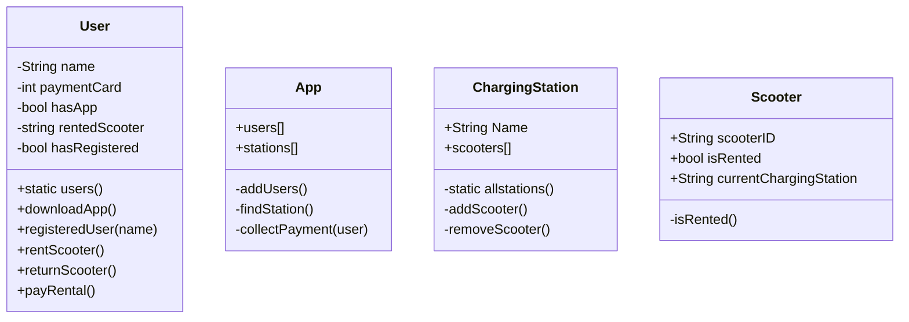

##### UNFORTUNATELY, GitHub still doesn't support mermaid

```mermaid
stateDiagram
User --> Download_App
Download_App --> User_Registration
User_Registration --> Locate_Charging_Stations
Locate_Charging_Stations --> Go_To_Nearest_Station_With_Available_Scooter
Go_To_Nearest_Station_With_Available_Scooter --> Rent_A_Scooter
Rent_A_Scooter --> Return_The_Scooter_At_An_Available_Station
Return_The_Scooter_At_An_Available_Station --> Pay_Rental
```

```mermaid
classDiagram
class User{
  -String name
  -int paymentCard
  -bool hasApp
  -string rentedScooter
  -bool hasRegistered
  +static users()
  +downloadApp()
  +registeredUser(name)
  +rentScooter()
  +returnScooter()
  +payRental()
}
class App{
	+users[]
	+stations[]
	-addUsers()
	-findStation()
	-collectPayment(user)
}
class ChargingStation{
	+String Name
	+scooters[]
	-static allstations()
	-addScooter()
	-removeScooter()
}
class Scooter{
	+String scooterID
	+bool isRented
	+String currentChargingStation
	-isRented()
}
```
